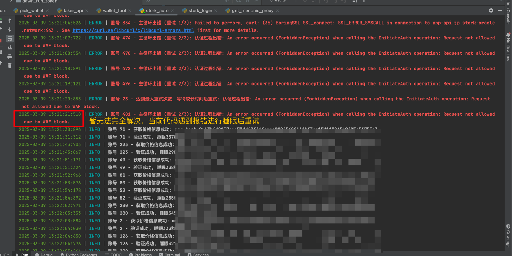

# ILSH STORK 交互脚本  ⭐ 如果有用请给我一个star

# 问题
* WAF block问题，无法解决，目前使用：睡眠+重试

## 注意事项

⚠️ 重要安全提示：

1. 代理配置需使用可靠的服务商

## 社区支持

💬 空投信息、脚本频道：[Telegram频道](https://t.me/ilsh_auto)
🐦 最新更新：[X官方账号](https://x.com/hashlmBrian)
🚀 AI交互自动化工具

## 功能特点
- 账号自动刷新Token、验证价格

## 效果展示

## 安装说明
* 出现问题请先使用deepseek、chatgpt询问

### python部分

用于stork客户端交互交互

1. 安装依赖：
   pip install -r requirements.txt
2. 填入已注册的账号信息到acc
3. 运行 python stork_auto.py

## 支持开发

☕ 如果您觉得这个工具有帮助，可以通过发送 USDT 来支持开发:

- 网络: TRC20
- 地址: `TAiGnbo2isJYvPmNuJ4t5kAyvZPvAmBLch`
